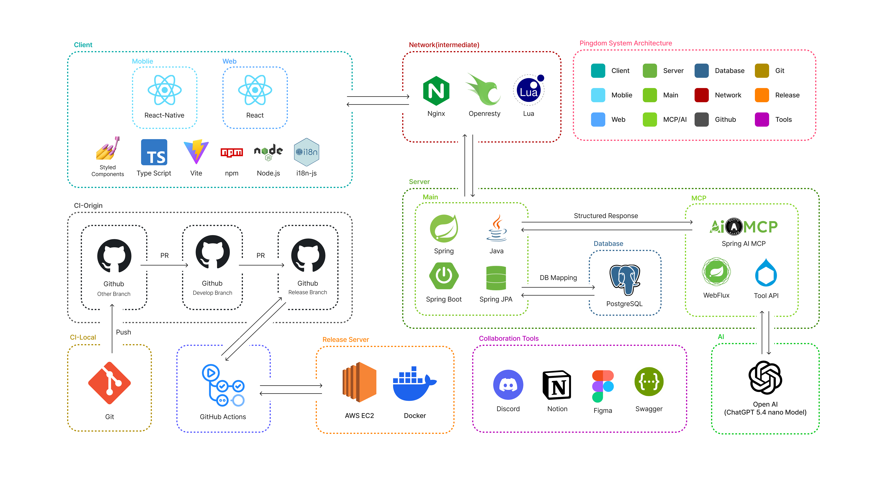

  

# Pingdom

**한국에서 갈 곳을 더 쉽게.** 
장소를 발견하고, 방문 경험을 기록하며, 다음 선택을 이어 갑니다.

**사용자와 사업자를 잇는 장소 경험.** 
탐색·저장·콘텐츠·예약·혜택·운영 정보를 하나로 연결합니다.

**신뢰할 수 있는 서비스 운영.** 
정확한 정보와 일관된 운영 흐름으로 더 나은 방문 경험을 만듭니다.

Pingdom은 장소 탐색, 사진 기반 기록, 개인화 추천, 사업자 운영, 예약·혜택·결제와
AI 기반 소상공인 컨설팅을 제공하는 서비스입니다. 
모바일 애플리케이션, 관리자 웹, 컨설팅 웹, 백엔드 API, MCP 서버와 네트워크 인프라로
구성됩니다.

---

## 프로젝트 상태

Pingdom은 현재 **GA(General Availability)** 단계입니다.

| 항목 | 상태 |
|---|---|
| 개발 단계 | `GA` |
| 릴리스 상태 | `Generally Available` |
| 안정성 | `Stable` |

---

## 주요 기능

| 기능 영역 | 제공 기능 |
|---|---|
| 인증 및 계정 | 이메일 계정, JWT, OAuth2/OIDC, 사용자·사업자 권한과 계정 상태 관리 |
| 장소 탐색 | 지도와 좌표 기반 장소 조회, 장소 상세 정보, 카테고리와 검색 결과 제공 |
| 콘텐츠 및 반응 | 사진 게시글, 북마크, 좋아요, 신고와 사용자 상호작용 처리 |
| 추천 | 위치와 사용자 행동 데이터를 활용한 장소 탐색 및 추천 결과 제공 |
| 사업자 운영 | 사업자 인증, 장소 소유권, 팀, 영업 정보와 장소 운영 데이터 관리 |
| 예약 및 상거래 | 상품, 예약 가능 상태, 혜택, 쿠폰, 결제, 환불과 정산 처리 |
| 관리자 기능 | 사용자·장소·사업자 검수, 신고, 제재와 운영 이력 관리 |
| AI 컨설팅 | 장소와 운영 데이터를 활용한 소상공인 입지·운영 분석 제공 |
| 알림 및 후속 처리 | 이메일·푸시 알림과 비동기 후속 작업 처리 |

---

## 서비스 구성

| 영역 | 역할 |
|---|---|
| 모바일 애플리케이션 | 사용자·사업자용 장소 탐색, 기록, 예약과 운영 화면 제공 |
| 관리자 웹 | 사용자, 장소, 사업자, 신고와 서비스 운영 기능 제공 |
| 컨설팅 웹 | 소상공인용 AI 입지·운영 분석 요청과 결과 제공 |
| 백엔드 API | 인증, 비즈니스 규칙, 데이터 저장, 외부 서비스 연동과 후속 처리 |
| MCP 서버 | AI 모델과 도구 API를 연결하고 구조화된 분석 결과 반환 |
| 네트워크 계층 | 외부 요청을 각 서비스로 전달하는 프록시와 로드밸런싱 처리 |

---

## 시스템 아키텍처

  

Pingdom은 모바일·웹 클라이언트의 요청을 네트워크 계층에서 처리한 뒤, 핵심 서비스와
AI·MCP 서비스가 각자의 책임에 맞게 응답하도록 구성합니다. 핵심 서비스는 데이터베이스와
연동해 서비스 데이터를 관리하고, AI·MCP 서비스는 필요한 도구 호출을 통해 구조화된
응답을 제공합니다. 애플리케이션은 GitHub Actions와 Docker를 이용해 AWS EC2 실행
환경에 배포합니다.

---

## 서비스 요청 및 데이터 처리

1. 모바일·웹 클라이언트의 요청은 Nginx와 OpenResty·Lua 기반 네트워크 계층을 거쳐
   핵심 API 서비스로 전달됩니다.
2. 핵심 API는 Spring Boot와 Spring JPA를 통해 비즈니스 규칙을 처리하고,
   PostgreSQL에 서비스 데이터를 저장하거나 조회합니다.
3. AI 기능이 필요한 요청은 핵심 서비스에서 MCP 서비스로 전달됩니다. MCP 서비스는
   Tool API와 AI 모델을 사용해 처리한 뒤 구조화된 응답을 핵심 서비스에 반환합니다.
4. API 명세는 Swagger로 관리해 클라이언트·서버·운영 도구 사이의 연동 기준을
   일관되게 유지합니다.

---

## 사용 기술

### 모바일 애플리케이션

| 구분 | 기술 | 적용 범위 |
|---|---|---|
| 기반 기술 | React Native 0.83, React 19, Expo SDK 55, TypeScript 5.9 | iOS·Android 애플리케이션과 Expo 기반 개발 환경 |
| 화면·스타일 | Styled Components 6, React Native SVG | 공통 UI 스타일과 벡터 이미지 표현 |
| 화면 이동 | React Navigation 7 | 인증, 탐색, 기록과 사업자 기능의 화면 전환 |
| 서버 상태 | TanStack Query 5, Axios 1.16 | API 요청, 캐시, 로딩·오류 상태와 데이터 동기화 |
| 클라이언트 상태 | Zustand 5, Async Storage, React Native Keychain | 화면 상태, 로컬 데이터와 인증정보 저장 |
| 위치·알림 | Expo Location, Expo Notifications, Firebase Messaging | 현재 위치 조회와 푸시 알림 처리 |
| 다국어 | i18next, react-i18next | 사용자 화면의 다국어 리소스와 문구 관리 |
| 검증 | Jest 29, Testing Library, TypeScript | 컴포넌트·회귀 테스트와 정적 타입 검증 |

### 관리자·컨설팅 웹

| 구분 | 기술 | 적용 범위 |
|---|---|---|
| 기반 기술 | React 19, TypeScript 6, Vite 8 | 관리자와 AI 컨설팅 웹 애플리케이션 구성 |
| 라우팅 | React Router 7 | 관리자 기능과 컨설팅 화면의 경로 구성 |
| 통신 | Axios | 백엔드 API 요청과 응답 처리 |
| 스타일 | Styled Components 6 | 화면 단위 스타일과 재사용 UI 구성 |
| 품질 관리 | ESLint 9, TypeScript ESLint | 코드 규칙과 타입 기반 정적 분석 |

### 백엔드 API

| 구분 | 기술 | 적용 범위 |
|---|---|---|
| 언어·프레임워크 | Java 21, Spring Boot 3.3, Spring MVC | REST API와 핵심 비즈니스 로직 실행 |
| 인증·보안 | Spring Security, OAuth2 Client, JWT | 이메일·소셜 로그인, 인증과 역할 기반 접근 제어 |
| 데이터 접근 | Spring Data JPA, Hibernate Spatial, JTS | 도메인 데이터와 공간 좌표 저장·조회 |
| 배치·비동기 처리 | Spring Batch, Spring AOP | 배치 작업과 공통 후속 처리 구성 |
| 운영 상태 | Spring Boot Actuator | 애플리케이션 상태와 운영 지표 확인 |
| 데이터 검증 | Spring Validation | API 입력값과 요청 계약 검증 |
| 파일·알림 연동 | AWS S3, Firebase Admin, Postmark | 파일 저장, 푸시 알림과 이메일 발송 |
| PDF 생성 | OpenHTML to PDF | AI 입지 분석 결과의 PDF 보고서 생성 |

### 데이터 및 공간 처리

| 구분 | 기술 | 적용 범위 |
|---|---|---|
| 관계형 데이터베이스 | PostgreSQL 16 | 사용자, 장소, 콘텐츠, 예약과 결제 데이터 저장 |
| 공간 데이터 | PostGIS, Hibernate Spatial, JTS | 좌표 기반 장소 조회와 공간 연산 |
| 캐시·상태 저장 | Redis 7 | 단기 상태, 캐시와 후속 처리 지원 |
| 스키마 관리 | Flyway | 데이터베이스 변경 이력과 순차 마이그레이션 관리 |

### AI·MCP

| 구분 | 기술 | 적용 범위 |
|---|---|---|
| MCP 서버 | Lua, Lapis, LuaJIT, Cqueues | 백엔드와 AI 모델 사이의 MCP 요청 처리 |
| 데이터 접근 | Pgmoon, PostgreSQL, PostGIS | 위치·유동인구 데이터 조회와 공간 데이터 처리 |
| 위치 처리 | Geohash | 좌표 인코딩과 위치 기반 데이터 가공 |
| AI 연동 | MCP Protocol, Tool API, LLM API | 도구 호출, 분석 실행과 구조화된 결과 반환 |
| 실행 환경 | OpenResty, Docker | MCP 서버 실행과 컨테이너 배포 |

### 네트워크 및 트래픽 처리

| 구분 | 기술 | 적용 범위 |
|---|---|---|
| API 게이트웨이 | Nginx, OpenResty, Lua, LuaJIT | 요청 라우팅, 인증 흐름과 Rate Limit 처리 |
| 네트워크 정보 | GeoLite2 ASN·Country Database | 요청 IP의 ASN과 국가 정보 조회 |
| 로드밸런서 | HAProxy 3.2 | Round Robin 분산, 헬스 체크와 경로별 타임아웃 처리 |
| 운영 에이전트 | C++20, CMake 3.20 | HAProxy Runtime API 상태 조회와 제어 |
| 접근 제어 | HAProxy Stick Table, ACL | 요청 속도 제한과 정적 IP 차단 |

### API 계약 및 테스트

| 구분 | 기술 | 적용 범위 |
|---|---|---|
| API 문서 | Springdoc OpenAPI, Swagger UI | 서비스별 REST API 명세 제공 |
| 계약 검증 | OpenAPI Diff, openapi-typescript | 호환성 비교와 클라이언트 타입 생성 |
| 백엔드 테스트 | JUnit 5, Spring Boot Test, Testcontainers, H2 | 단위·통합·PostgreSQL 기반 회귀 검증 |
| 프론트엔드 테스트 | Jest, Testing Library, ESLint | UI 동작, 회귀 시나리오와 정적 분석 |

### 빌드 및 배포

| 구분 | 기술 | 적용 범위 |
|---|---|---|
| 빌드 도구 | Gradle, npm, Vite, CMake | 백엔드·프론트엔드·운영 에이전트 빌드 |
| 자동화 | GitHub Actions | 검증, 이미지 빌드와 배포 작업 실행 |
| 컨테이너 | Docker, Docker Compose | 서비스별 실행 환경과 로컬 의존성 구성 |
| 실행 환경 | AWS EC2 | API, 네트워크와 AI 서비스 실행 |

---

## 배포 구성

| 구성요소 | 역할 |
|---|---|
| GitHub Actions | 애플리케이션 빌드와 배포 작업 자동화 |
| Docker | 서비스 실행 환경을 컨테이너 이미지로 구성 |
| AWS EC2 | 서버 애플리케이션과 네트워크 구성요소 실행 |
| Nginx·OpenResty | 외부 요청 수신과 서비스 라우팅 |
| HAProxy | 서비스 트래픽 분산 |

---

## 저장소 구성

| 저장소 | 설명 |
|---|---|
| [pingdom-app](https://github.com/Type-Nu11/pingdom-app) | React Native 기반 사용자·사업자 모바일 애플리케이션 |
| [pingdom-api](https://github.com/Type-Nu11/pingdom-api) | Java·Spring Boot 기반 핵심 API와 비즈니스 로직 |
| [pingdom-admin](https://github.com/Type-Nu11/pingdom-admin) | React 기반 관리자 웹 애플리케이션 |
| [pingdom-consulting](https://github.com/Type-Nu11/pingdom-consulting) | React 기반 AI 소상공인 컨설팅 웹 애플리케이션 |
| [pingdom-infra](https://github.com/Type-Nu11/pingdom-infra) | OpenResty·Lua 기반 리버스 프록시 |
| [pingdom-loadbalancer](https://github.com/Type-Nu11/pingdom-loadbalancer) | HAProxy·C++ 기반 로드밸런서 |
| [pingdom-mcp](https://github.com/Type-Nu11/pingdom-mcp) | Lapis·Lua 기반 AI·MCP 서버 |

---

Maintained by **Type-Nu11**

